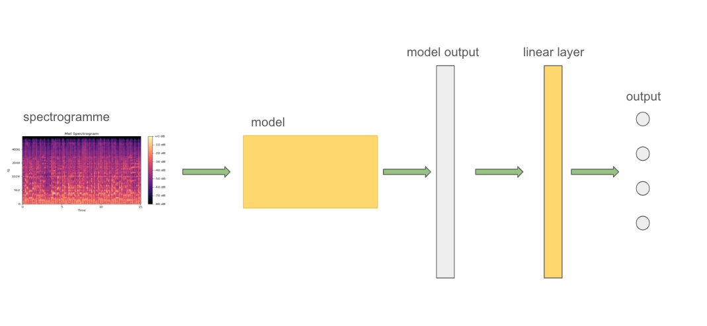

# Instruments Recognition

Auteurs : 
- Clémence Dumoulin
- Lazare Ricour-Dumas

Utiles :
- Le code de génération de dataset peut être trouvé dans le dossier dataset_creation.
- Le code lié à l'implémentation et à l'entrainement des modèles se trouve dans le notebook Projet_ML_M2AMIS.ipynb.
- L'entrainement a été effectué sur une instance Google Collab

## Introduction

Dans ce projet nous allons réaliser une tâche de classification de données sonores. Pour cela nous comparerons deux architectures de réseaux de neurones, les CNN et les LSTM. Nous détaillerons également le processus de constitution de notre dataset.

## Le Dataset 

Ce dataset en 4 classes (violoncelle, guitare, piano, violon) est composé d'échantillons sonores d'instruments de musique en 4 classes.

### Méthode

Le dataset a été généré à partir de vidéos de captation de concerts où un seul instrument de la classe était joué. Une fois l'audio de ces captations téléchargé, les séquences d'aplaudissement et de prise de parole tronquées, la séquence pendant laquelle on entend l'instrument joué est découpée en séquences de 5s avec un pas de 1s. C'est-à-dire qu'avec une séquence d'1h (i.e 3600s), on obtient 3600 - 5 = 3595 séquences de 5s distinctes et non pas 3600 / 5 = 720.

Voici la répartition du dataset ainsi obtenu


### Problèmes liés au dataset

La première génération du dataset était constituée de 26009 séquences de 5s avec un sampling rate de 48000Hz. Une séquence était donc un vecteur de taille 5 * 48 000 = 240 000 valeurs. L'ensemble pèse 22Go. Ce volume de données rendait impraticable l'utilisation d'un GPU gratuit sur Google Collab, et l'entrainement était bien trop long en local sur un CPU.

Deux approches ont donc été envisagées et implémentées : 
- Un resampling de l'ensemble du dataset à un sampling rate inférieur à 48000
- Stockage de l'ensemble du dataset sous forme de spectrogramme de MEL, où l'information est bien plus condensée

La solution retenue a été celle des spectrogrammes de MEL, car le dataset sous forme de fichiers wav aurait de toute façon fini transformé en spectrogramme, on s'évite ainsi du temps de calcul au moment de loader le dataset. Un spectrogramme est un tensor de shape [2, 64, 431] et une fois compressé, l'ensemble du dataset pèse environ 5Go et peut donc être stocké sur Google Drive. On décompresse le dataset dans une session Collab avant l'entrainement.

### Structure du dossier `dataset_creation`

Le dossier `dataset_creation` est organisé comme suit :

```
dataset_creation/
├── exports/
│   ├── hugging_face_utils.py
│   ├── resample_dataset.py
│   └── gen_spec_dataset.py
├── AudioUtil.py
├── data_viz.py
├── gen_dataset.py
└── ReadMe.md
```
### Description des fichiers

- **exports/** : Contient des scripts pour exporter et manipuler le datasets.
    - **hugging_face_utils.py** : Utilitaires pour l'intégration avec la bibliothèque Hugging Face.
    - **resample_dataset.py** : Script pour le dataset avec un sampling rate différent.
    - **gen_spec_dataset.py** : Script pour générer le dataset sous forme de spectrogramme de MEL.

- **AudioUtil.py** : Contient des fonctions utilitaires pour le traitement audio.

- **data_viz.py** : Script pour la visualisation des données.

- **gen_dataset.py** : Script de génération du dataset à partir des données audios brutes


## Concepts pour la reconnaissance sonore

### Signal audio

Un signal audio dans PyTorch est une approximation discrète d'une onde sonore continue. Il est constitué d'un sampling rate qui est une valeur entière exprimée en Hz, et d'un signal qui est un vecteur contenant les valeurs qui approximent l'onde sonore.

### Spectrogramme de MEL

Un spectrogramme de Mel est une représentation visuelle d'un signal audio dans le temps, les fréquences et l'intensité, exprimée selon une échelle perceptuelle appelée échelle de Mel.

Cette échelle est conçue pour refléter la façon dont l'oreille humaine perçoit les fréquences, en accentuant les basses fréquences et en compressant les hautes fréquences.

Le spectrogramme est obtenu en appliquant une transformée de Fourier sur des fenêtres successives du signal, puis en passant les résultats par un ensemble de filtres triangulaires alignés sur l'échelle de Mel.

*Ci-dessous on voit un exemple de spectrogramme de MEL, le signal sonore était un signal stereo, il y a donc deux spectrogrammes. Les barres horizontales et verticales appelées masking sont une technique de data augmentation utilisée en reconnaissance audio*


### L'architecture

On utilise une architecture composée d'un modèle, qu'on définira plus tard, qui fait l'analyse du spectrogramme donné en input et dont l'output est passé dans une linear layer qui le transforme en un output qu'on peut interpréter comme une classifcation. 



### Les modèles

#### CNN

Notre CNN a la forme suivante, il est composé de 4 couches de convolution et de 3 couches de MaxPooling

```
CNN_Classifier(
  (conv1): Conv2d(2, 8, kernel_size=(5, 5), stride=(2, 2), padding=(2, 2))
  (relu1): ReLU()
  (pool1): MaxPool2d(kernel_size=2, stride=2, padding=0, dilation=1, ceil_mode=False)
  (conv2): Conv2d(8, 16, kernel_size=(3, 3), stride=(2, 2), padding=(1, 1))
  (relu2): ReLU()
  (pool2): MaxPool2d(kernel_size=2, stride=2, padding=0, dilation=1, ceil_mode=False)
  (conv3): Conv2d(16, 32, kernel_size=(3, 3), stride=(2, 2), padding=(1, 1))
  (relu3): ReLU()
  (pool3): MaxPool2d(kernel_size=2, stride=2, padding=0, dilation=1, ceil_mode=False)
  (conv4): Conv2d(32, 64, kernel_size=(3, 3), stride=(2, 2), padding=(1, 1))
  (relu4): ReLU()
)
```
On constate qu'on atteint dès la 2ème epoch une accuracy supérieure à 95%. Cela est sans doute du au fait que les poids sont updatés après chaque mini-batch de 16 inputs, une epoch suffit donc au modèle pour atteindre des performances acceptables. 

Notre but étant plus d'expérimenter que d'obtenir un modèle fiable à inférer, nous avons choisi de ne pas implémenter une stratégie d'early stopping afin d'être capable d'observer de l'overfitting s'il y en avait.

*Le résultat de l'entrainement est donné ci-dessous*


#### LSTM

Les LSTM sont des réseaux récurrents adaptés pour analyser des séquences de données. Pour entraîner notre LSTM nous avons transformé nos inputs stereo (deux canaux) en mono (un seul canal). Un spectrogramme peut être vu comme une séquence d'inputs (en l'occurence 64 inputs de taille 431).

Notre LSTM a la forme suivante 

```
LSTM_Classifier(
  (lstm): LSTM(431, 862, num_layers=2, batch_first=True, dropout=0.5)
)
```

Comme le CNN, et nous pensons pour les mêmes raisons, le LSTM atteint une accuracy correcte dès la première epoch. Son evaluation accuracy est même plus élevée à la première epoch avant de se remettre au niveau de la training accuracy plus loin dans l'entrainement. Ce cas de figure ne se présente pas avec le CNN.

Nous pensons que cela est du à la technique de data-augmentation utilisée à la création du dataset qui implique que des séquences sonore se répètent en partie d'un échantillon à un autre. Le LSTM étant plus optimisé pour analyser les séquances de données, il est peut être capable de généraliser plus rapidement sur ce jeu de données.

Les données de loss vont dans le même sens que celles de l'accuracy car même si toutes les classes ne sont pas de même taille, des facteurs multiplicateurs correspondants ont été appliqués dans la fonction de loss.


*Le résultat de l'entrainement est donné ci-dessous*


## Conclusion

Le LSTM atteint des performances supérieures au CNN. C'est au prix d'une taille bien plus importante (105Ko pour le CNN et 41,7Mo pour le LSTM) et d'un temps d'entrainement presque 4 fois plus élevé (20mn pour le LSTM, 5mn pour le CNN) bien que cette information soit à pondérer par le fait que les GPU gratuits de Google Collab sont partagés.

## Sources 
- https://www.youtube.com/watch?v=jU9qzXVlwCY
- https://www.youtube.com/watch?v=PWX_mohRkQ4
- https://www.youtube.com/watch?v=WfdjHyciN3E
- https://www.youtube.com/watch?v=4l5Ef8hMXEg